# 基于web的酒店客房管理系统

#### 介绍

我开发了一个基于Web的酒店客房管理系统，旨在通过现代化的管理工具提升酒店客房管理的效率和用户体验。该系统分为管理员角色和用户角色，管理员负责管理用户、客房信息、预约、入住、退房等内容，用户则可以查询客房信息、进行预约、管理入住和退房等操作。系统通过丰富的功能模块，提供了便捷的操作界面和高效的管理机制，为酒店管理和用户服务提供了一体化的解决方案。

#### 技术栈

后端技术栈：Springboot+Mysql+Maven

前端技术栈：Vue+Html+Css+Javascript+ElementUI

开发工具：Idea+Vscode+Navicate

#### 系统功能介绍

管理员角色功能模块

个人中心：管理员可以管理个人信息，修改密码等，保障账户的安全性和信息的时效性。  
用户管理：管理注册用户的信息，包括添加、修改和删除用户信息，确保用户信息的准确和完整。  
会员管理：管理酒店会员的信息，提供会员优惠和特殊服务，提高用户满意度和忠诚度。  
清洁人员管理：管理清洁人员的信息和工作安排，确保酒店客房的清洁和维护。  
客房信息管理：录入和管理客房的基本信息，包括客房类型、价格、设施、状态等，确保客房信息的准确和及时更新。  
用户预约管理：管理用户的客房预约信息，包括预约的生成、查询、修改和删除，确保预约信息的准确和及时。  
会员预约管理：管理会员的客房预约信息，提供会员专属的预约服务和优惠。  
用户取消管理：处理用户取消的预约信息，包括取消原因的记录和退款处理，提升用户体验。  
会员取消管理：处理会员取消的预约信息，包括取消原因的记录和退款处理，提升用户体验。  
用户入住管理：管理用户的入住信息，包括入住的登记、查询、修改和退房，确保入住信息的准确和及时。  
会员入住管理：管理会员的入住信息，提供会员专属的入住服务和优惠。  
用户退房管理：管理用户的退房信息，包括退房的登记、查询、修改和结算，确保退房信息的准确和及时。  
会员退房管理：管理会员的退房信息，提供会员专属的退房服务和优惠。  
清扫房间管理：安排和管理房间的清扫工作，确保房间的清洁和维护。  
留言板管理：管理用户的留言和反馈，包括留言的审核、回复和删除，确保平台的互动性和用户满意度。  
系统管理：系统的整体管理与维护，包括用户权限管理、系统日志查看、数据备份与恢复等，确保系统的安全稳定运行。  

用户角色功能模块

客房信息：浏览客房的详细信息，包括客房类型、价格、设施、状态等，方便用户了解和选择客房。  
酒店资讯：查看酒店的最新资讯和公告，包括促销活动、酒店新闻等，获取及时的酒店信息。  
留言反馈：用户可以在留言板上留言反馈意见和建议，包括对客房、服务、设施的评价和建议，提升平台的互动性和用户满意度。  
个人中心：用户可以管理个人信息，修改密码等，保障账户的安全性和信息的时效性。  
在线客服：用户可以通过在线客服与酒店进行实时沟通，获取帮助和支持。  
后台管理：  
用户预约管理：用户可以管理自己的客房预约信息，包括预约的生成、查询、修改和删除，确保预约信息的准确和及时。  
用户取消管理：用户可以管理已取消的预约信息，包括取消原因的记录和退款处理，提升用户体验。  
用户入住管理：用户可以管理自己的入住信息，包括入住的登记、查询、修改和退房，确保入住信息的准确和及时。  
用户退房管理：用户可以管理自己的退房信息，包括退房的登记、查询、修改和结算，确保退房信息的准确和及时。  
我的收藏管理：用户可以管理个人收藏的客房、资讯等，方便快速访问常用资源。  

#### 系统作用

管理员角色：通过全面的管理功能模块，管理员可以高效地管理用户、客房信息、预约、入住、退房等内容，确保信息的准确性和及时更新。同时，通过留言板管理、清扫房间管理等模块，管理员可以及时处理用户的反馈和需求，提升服务质量和用户满意度。  

用户角色：用户可以通过系统方便地浏览客房信息、进行预约和管理入住和退房等操作。通过个人中心和后台管理，用户可以管理自己的预约、入住和退房信息，提升入住体验的灵活性和便利性。留言反馈和在线客服功能使用户能够与酒店互动，提供意见和建议，提升整体用户体验。

#### 系统功能截图

代码结构

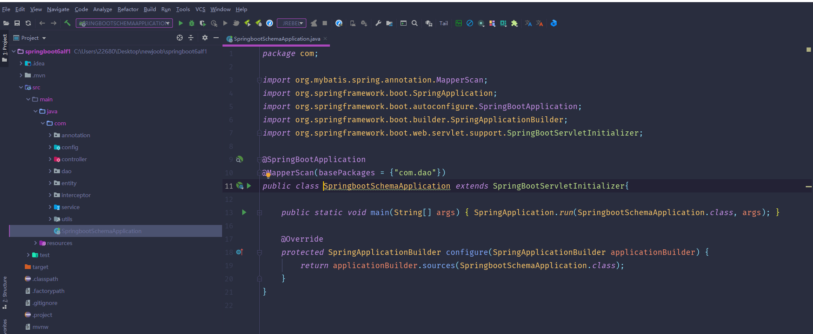

数据库表

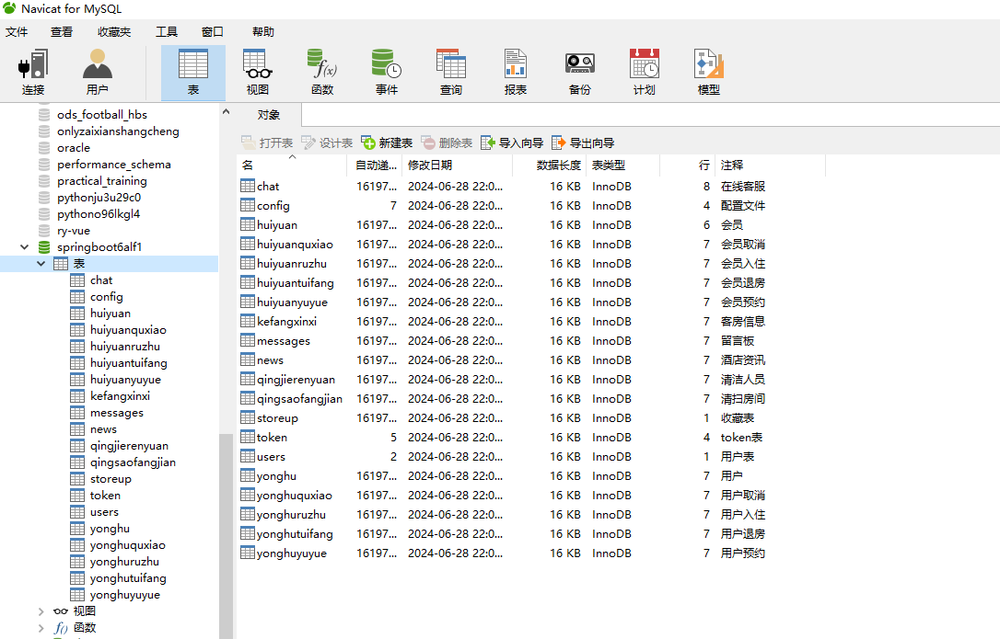

登录

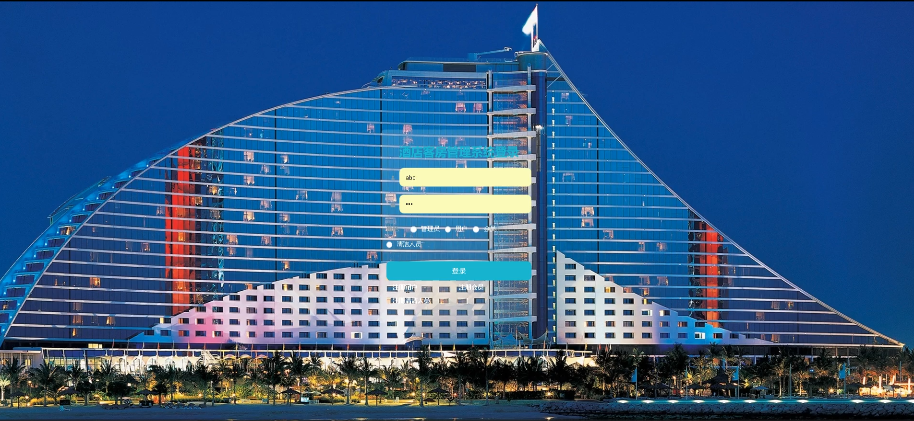

用户管理

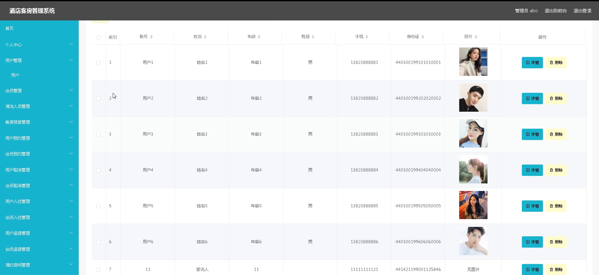

清洁人员管理

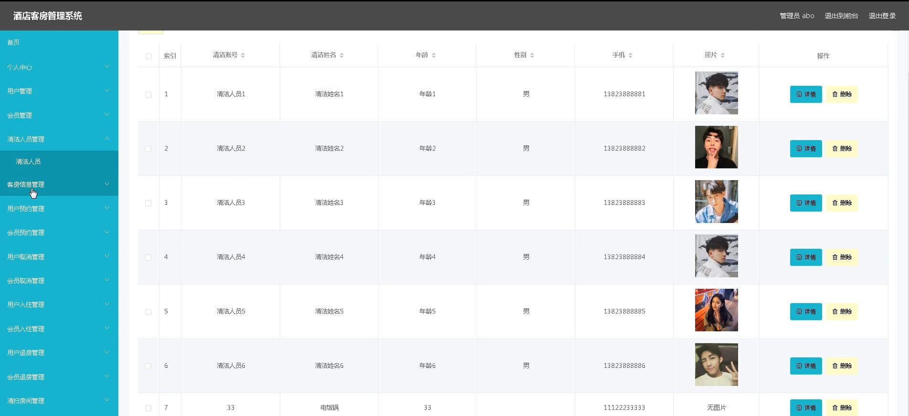

客房信息管理

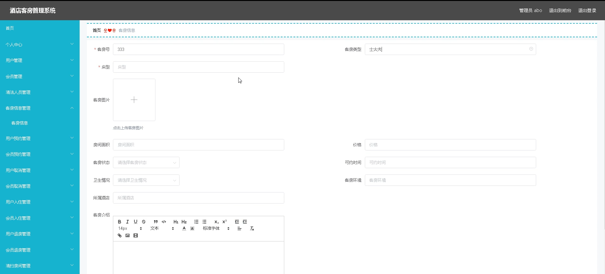

用户预约管理

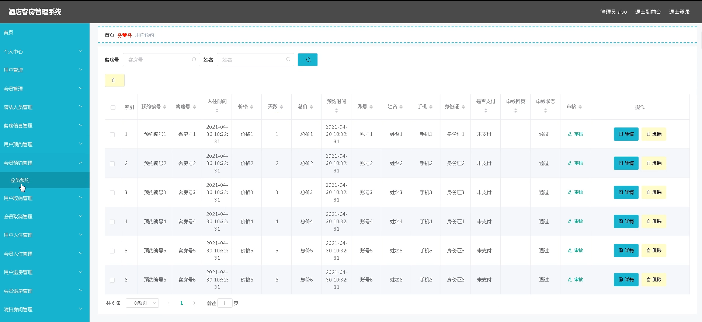

用户预约管理

系统管理

用户端后台管理

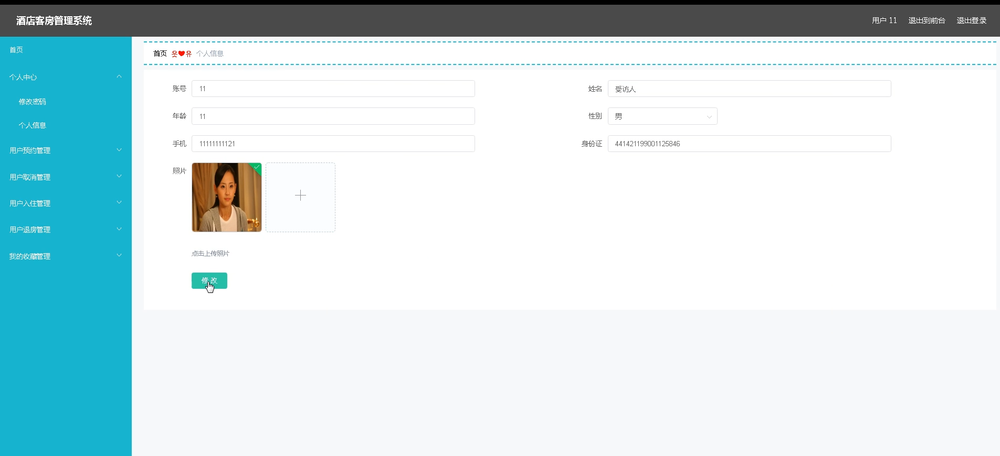

前台页面客房信息

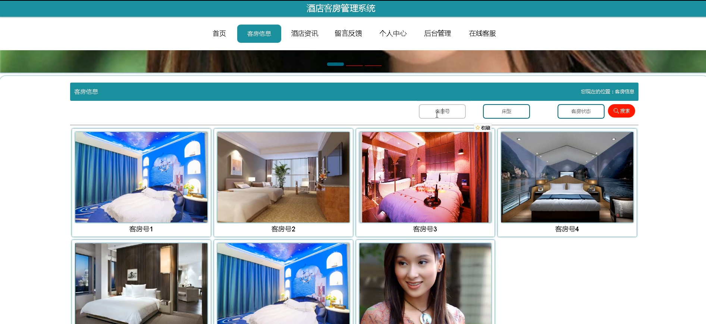

留言反馈

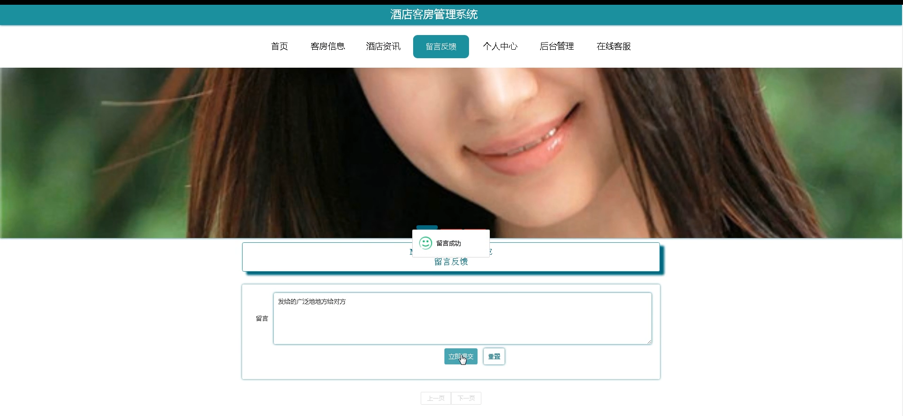

在线客服

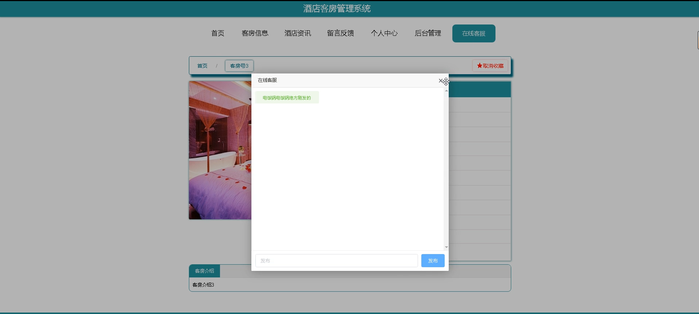

用户预约

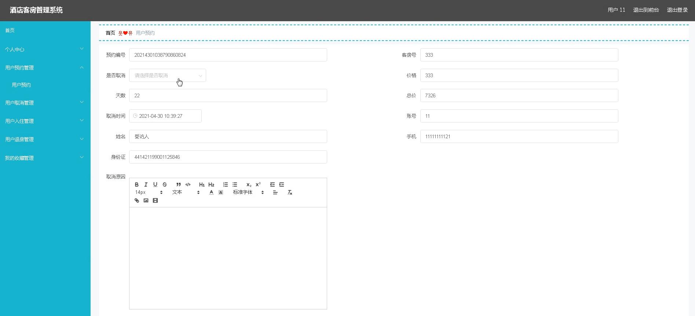

#### 总结

基于Web的酒店客房管理系统通过集成多个功能模块，实现了客房信息的高效管理和便捷查询预约。管理员和用户通过各自的角色和功能模块，提升了管理效率和用户体验。系统的全面性和互动性使其能够满足不同用户的需求，提升了酒店服务的整体水平。未来可以根据用户反馈和需求，继续优化和扩展系统功能，提供更完善的服务。

#### 使用说明

创建数据库，执行数据库脚本 修改jdbc数据库连接参数 下载安装maven依赖jar 启动idea中的springboot项目

后台地址：http://localhost:8080/springboot6alf1/admin/dist/index.html

管理员  abo 密码 abo

前台地址：http://localhost:8080/springboot6alf1/front/index.html
